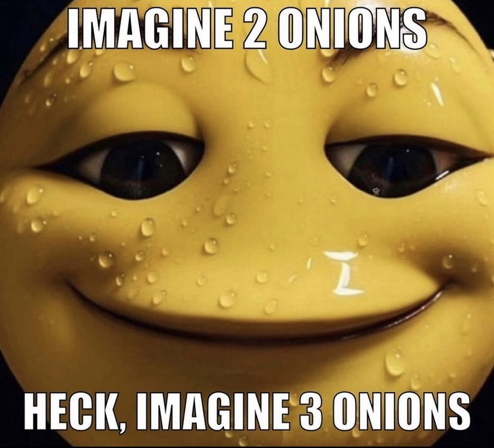

# courseraWebpage
<!DOCTYPE html>
<html lang="en">
<head>
    <meta charset="UTF-8">
    <meta name="viewport" content="width=device-width, initial-scale=1.0">
</head>
<body>
    <main> 
        <h1> Hello Kitten. .</h1>
        
        
 please text me pls pls plssssss

        
        <h3> Reasons:</h3>
        <ol>
            <li> I am so smart
            <li> I am so smarthandsome (mom said so)
            <li> I am fort nite approved
            <li> <a href="https://www.youtube.com/watch?v=eRBOgtp0Hac"> I am a silly guy</a>
            </li>
        </ol>
        
    </main>
</body>
</html>
